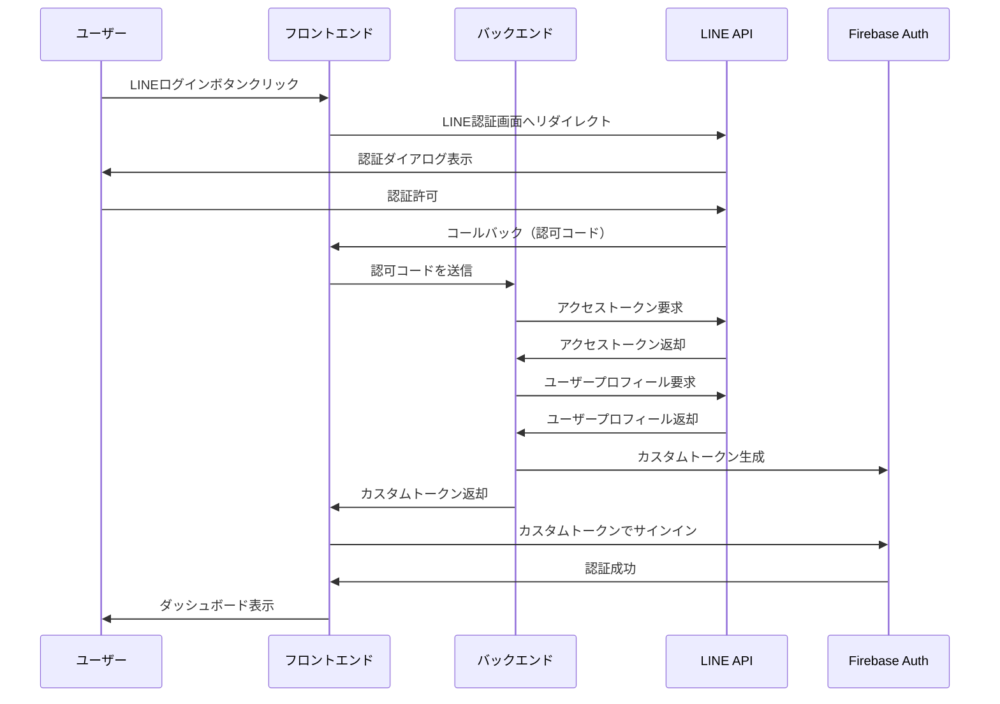

# Firebase Authentication × LINE Login デモサイト

Firebase Authentication と LINE Login を連携したデモサイトです。スマートフォン環境（特に iOS Safari）でも安定して動作するカスタム認証フローを実現しています。

## 概要

このプロジェクトは、LINEログインを通じて Firebase Authentication にユーザーをログインさせる技術構成の検証と共有を目的としたデモサイトです。特にスマートフォン環境（iOS Safari）での安定動作を確認するために、LINE SDK を利用したカスタム認証フローを実装しています。

## 技術スタック

- **フロントエンド**: Nuxt 3
- **バックエンド**: Firebase Functions (Node.js)
- **認証基盤**: Firebase Authentication (カスタム認証)
- **ログインプロバイダ**: LINE Login
- **ホスティング**: Firebase Hosting
- **CI/CD**: GitHub Actions

## ディレクトリ構成

```
firebase-line-login-demo/
├── functions/                   # バックエンド：Firebase Functions（Node.js）
│   ├── src/
│   │   ├── index.ts            # Functions のエントリーポイント
│   │   └── handlers/
│   │       └── lineCallback.ts # LINE OAuth コールバック処理
│   ├── package.json
│   ├── tsconfig.json
│   └── .eslintrc.json
│
├── frontend/                    # フロントエンド：Nuxt 3 アプリケーション
│   ├── pages/
│   │   ├── index.vue           # トップページ（ログインボタンなど）
│   │   └── dashboard.vue       # 認証後に遷移するページ
│   ├── composables/
│   │   └── useAuth.ts          # Firebase認証状態の管理用Composable
│   ├── plugins/
│   │   └── firebase.client.ts  # Firebase JS SDK の初期化
│   ├── nuxt.config.ts
│   ├── package.json
│   ├── tsconfig.json
│   └── .output/                # `nuxi build` による静的出力先
│
├── firebase.json               # Firebase Hosting & Functions 設定ファイル
├── .firebaserc                 # Firebase プロジェクト設定
└── README.md
```

## セットアップ手順

### 1. 前提条件

- Node.js 18 以上
- npm 9 以上
- Firebase CLI
- Firebase プロジェクト
- LINE Developers アカウント

### 2. Firebase プロジェクトの設定

1. [Firebase Console](https://console.firebase.google.com/) でプロジェクトを作成
2. Authentication を有効化
3. Functions を有効化
4. Hosting を有効化

### 3. LINE Developers の設定

1. [LINE Developers Console](https://developers.line.biz/console/) でプロバイダーとチャネルを作成
2. チャネルの種類は「ウェブアプリ」を選択
3. コールバックURLを設定（例: `http://localhost:3000`）
4. チャネルID、チャネルシークレットを取得

### 4. 環境変数の設定

1. `functions/.env.local.example` を `functions/.env.local` にコピーして編集
2. `frontend/.env.local.example` を `frontend/.env.local` にコピーして編集

### 5. ローカル開発環境のセットアップ

```bash
# Firebase CLI のインストール
npm install -g firebase-tools

# Firebase にログイン
firebase login

# バックエンドの依存関係インストール
cd functions
npm install

# フロントエンドの依存関係インストール
cd ../frontend
npm install
```

### 6. ローカル開発サーバーの起動

```bash
# Firebase Emulator の起動
firebase emulators:start

# 別ターミナルでフロントエンドの開発サーバーを起動
cd frontend
npm run dev
```

### 7. デプロイ

```bash
# フロントエンドのビルド
cd frontend
npm run build

# Firebase へのデプロイ
firebase deploy
```

## 認証フロー



## iOS Safari での問題回避策

iOS Safari で `signInWithRedirect` を使用して LINE ネイティブアプリで認証を行うと、Safari にリダイレクトされる際に別タブで開かれてしまい、Firebase Authentication のセッションストレージが共有されず認証が失敗する問題があります。

この問題を回避するために、以下の対策を実装しています：

1. LINE SDK を使用せず、カスタム認証フローを実装
2. バックエンドでのトークン処理により、フロントエンドでのセッション状態管理を簡素化
3. コールバック処理後のリダイレクト先を適切に設定し、同一タブでの処理を保証

## ライセンス

MIT

## 参考資料

- [Firebase 公式ブログ: LINEログインとの連携方法](https://developers-jp.googleblog.com/2016/11/authenticate-your-firebase-users-with-line-login.html)
- [LINE Login v2.1 ドキュメント](https://developers.line.biz/ja/docs/line-login/)
- [Firebase Authentication ドキュメント](https://firebase.google.com/docs/auth)
- [Firebase Functions ドキュメント](https://firebase.google.com/docs/functions)
- [Nuxt 3 ドキュメント](https://nuxt.com/docs)